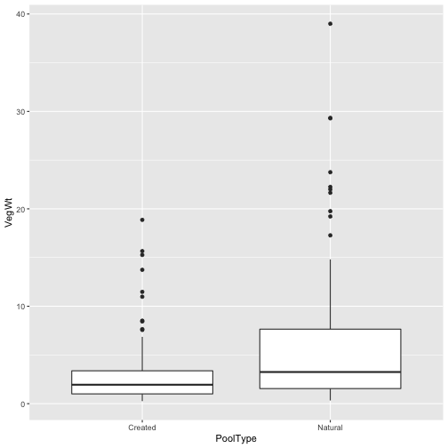
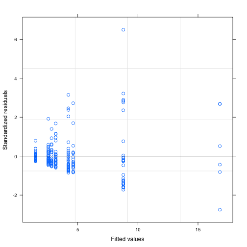

Jackson Anderson
Thesis Analysis
Department of Ecology and Evolutionary Biology, CU Boulder
Fall 2020


```r
#### Package Calls ####

library(ggplot2)
library(tidyverse)
library(lme4)
library(nlme)
library(lattice)
library(wesanderson)


#### Questions, Hypothesis, Prediction ####
```

__Questions__
Do plants living in created or natural pools experience different levels of environmental stress? 
If there does appear to be a treatment effect, when using pool type as a predictor, how does the variation within each treatment differ
What are the potential effects on the outcome of the study due to experimental design?

__Hypothesis__
Pool type (natural vs created) will have an effect on plant biomass and reproductive biomass

__Predictions__
mean plant biomass will be higher in artificially created pools than naturally created pools because of the habitat homogeneity present in the artificially created pools. This is based on the assumption that the habitat in the artificially created pools is suited for l. fremontii. 


```r
#### Data ####
```

__Reading in Data__


```r
bealeDat <- Beale2015_transplantdata_forJackson

view(bealeDat)

#### Primary Visualizations ####
```

__Weight by PoolType__


```r
weightDat <- bealeDat %>%
  filter(!is.na(VegWt))

ggplot(weightDat, aes(PoolType, VegWt)) +
  geom_boxplot()
```



The above visualization is interesting: It would seem that the weight of plants within the created pools are less than those in the natural pool. If weight is to be used as a metric of stress, those that weigh less are considered to be more stressed (cite)

__Reproductive Biomass by PoolType__


```r
reproDat <- bealeDat %>%
  filter(!is.na(ReproWt))

ggplot(reproDat, aes(PoolType, ReproWt)) +
  geom_boxplot()
```


The above visualization further confirms the notion that plants in the created pools as their reproductive biomass is less than that in the natural pool, if we are to take reproductive biomass as an indicator of reproductive effort. 

__Inflorescence Biomass by PoolType__

Vis. One: Inflorescense Weight alone


```r
infloDat <- bealeDat %>%
  filter(!is.na(FullInflorWt))

ggplot(infloDat, aes(PoolType, FullInflorWt)) +
  geom_boxplot()
```


Vis. Two: #percentage of total energy investment given to reproductive growth 


```r
infloDat <- infloDat %>%
  filter(!is.na(VegWt))

infloDat$reproPropn<- (infloDat$ReproWt + infloDat$VegWt) / infloDat$ReproWt #percentage of total energy investment given to reproductive growth 

ggplot(infloDat, aes(PoolType, reproPropn)) +
  geom_boxplot()
```


The above graph suggests that, of the total energy invested into growth, more is invested into reproduction in the natural pools


```r
#### Response Variable Analysis and Behavior ####

#### Vegitative Biomass Modeling ####
```

__Stress Test: Veg. Biomass__
modeling stress


```r
veglme <- lme(VegWt~PoolType , random = ~1 | PoolID/Trans, data = weightDat)
summary(veglme)
```

```
## Linear mixed-effects model fit by REML
##  Data: weightDat 
##        AIC      BIC    logLik
##   1291.925 1308.708 -640.9625
## 
## Random effects:
##  Formula: ~1 | PoolID
##         (Intercept)
## StdDev:    4.592074
## 
##  Formula: ~1 | Trans %in% PoolID
##         (Intercept) Residual
## StdDev: 0.001282872 4.653771
## 
## Fixed effects: VegWt ~ PoolType 
##                    Value Std.Error  DF  t-value p-value
## (Intercept)     2.855685  2.331065 198 1.225056  0.2220
## PoolTypeNatural 5.406100  3.329672   6 1.623613  0.1556
##  Correlation: 
##                 (Intr)
## PoolTypeNatural -0.7  
## 
## Standardized Within-Group Residuals:
##        Min         Q1        Med         Q3        Max 
## -2.7483169 -0.4254198 -0.1791332  0.1276922  6.4920995 
## 
## Number of Observations: 214
## Number of Groups: 
##            PoolID Trans %in% PoolID 
##                 8                16
```

```r
plot.lme(veglme)
```



```r
qqnorm(veglme, ~resid(., type = "p"), abline = c(0,1))
```


```r
#response variable distribution is heteroskedastic; will try an unequal variances model to see if it solves the issue.

veglme_uv <- lme(VegWt~PoolType , random = ~1 | PoolID/Trans, data = weightDat, weights = varIdent(form = ~1|PoolType))

summary(veglme_uv)
```

```
## Linear mixed-effects model fit by REML
##  Data: weightDat 
##       AIC     BIC    logLik
##   1226.78 1246.92 -607.3902
## 
## Random effects:
##  Formula: ~1 | PoolID
##         (Intercept)
## StdDev:    3.984099
## 
##  Formula: ~1 | Trans %in% PoolID
##          (Intercept) Residual
## StdDev: 0.0001816951  6.68409
## 
## Variance function:
##  Structure: Different standard deviations per stratum
##  Formula: ~1 | PoolType 
##  Parameter estimates:
##   Natural   Created 
## 1.0000000 0.4375711 
## Fixed effects: VegWt ~ PoolType 
##                    Value Std.Error  DF  t-value p-value
## (Intercept)     2.856206  2.008054 198 1.422375  0.1565
## PoolTypeNatural 5.070092  2.957815   6 1.714134  0.1373
##  Correlation: 
##                 (Intr)
## PoolTypeNatural -0.679
## 
## Standardized Within-Group Residuals:
##        Min         Q1        Med         Q3        Max 
## -1.6378162 -0.4639242 -0.2211500  0.1477245  5.0018643 
## 
## Number of Observations: 214
## Number of Groups: 
##            PoolID Trans %in% PoolID 
##                 8                16
```

```r
plot.lme(veglme_uv) 
```


```r
qqnorm(veglme_uv, ~resid(., type = "p"), abline = c(0,1))
```


```r
#somewhat better on the residual distribution front, but the qqplot does not look ideal. Will log transform the response variable and see if that helps

weightDat$logVegWt <- log1p(weightDat$VegWt)

veglme_log <- lme(logVegWt~PoolType , random = ~1 | PoolID/Trans, data = weightDat)
summary(veglme)
```

```
## Linear mixed-effects model fit by REML
##  Data: weightDat 
##        AIC      BIC    logLik
##   1291.925 1308.708 -640.9625
## 
## Random effects:
##  Formula: ~1 | PoolID
##         (Intercept)
## StdDev:    4.592074
## 
##  Formula: ~1 | Trans %in% PoolID
##         (Intercept) Residual
## StdDev: 0.001282872 4.653771
## 
## Fixed effects: VegWt ~ PoolType 
##                    Value Std.Error  DF  t-value p-value
## (Intercept)     2.855685  2.331065 198 1.225056  0.2220
## PoolTypeNatural 5.406100  3.329672   6 1.623613  0.1556
##  Correlation: 
##                 (Intr)
## PoolTypeNatural -0.7  
## 
## Standardized Within-Group Residuals:
##        Min         Q1        Med         Q3        Max 
## -2.7483169 -0.4254198 -0.1791332  0.1276922  6.4920995 
## 
## Number of Observations: 214
## Number of Groups: 
##            PoolID Trans %in% PoolID 
##                 8                16
```

```r
plot.lme(veglme_log)
```


```r
qqnorm(veglme_log, ~resid(., type = "p"), abline = c(0,1))
```


```r
#this is much better! Will try and unequal variances model to see if we can improve it further

veglme_log_uv <- lme(logVegWt~PoolType , random = ~1 | PoolID/Trans, data = weightDat, weights = varIdent(form = ~1|PoolType))

summary(veglme_log_uv)
```

```
## Linear mixed-effects model fit by REML
##  Data: weightDat 
##        AIC      BIC    logLik
##   424.4054 444.5449 -206.2027
## 
## Random effects:
##  Formula: ~1 | PoolID
##         (Intercept)
## StdDev:   0.4567979
## 
##  Formula: ~1 | Trans %in% PoolID
##          (Intercept)  Residual
## StdDev: 2.458847e-05 0.7169272
## 
## Variance function:
##  Structure: Different standard deviations per stratum
##  Formula: ~1 | PoolType 
##  Parameter estimates:
##   Natural   Created 
## 1.0000000 0.7595716 
## Fixed effects: logVegWt ~ PoolType 
##                     Value Std.Error  DF  t-value p-value
## (Intercept)     1.1520716 0.2332065 198 4.940135  0.0000
## PoolTypeNatural 0.6222486 0.3394580   6 1.833065  0.1165
##  Correlation: 
##                 (Intr)
## PoolTypeNatural -0.687
## 
## Standardized Within-Group Residuals:
##        Min         Q1        Med         Q3        Max 
## -2.0790085 -0.7169233 -0.1292156  0.5220051  2.9858361 
## 
## Number of Observations: 214
## Number of Groups: 
##            PoolID Trans %in% PoolID 
##                 8                16
```

```r
plot.lme(veglme_log_uv) 
```


```r
qqnorm(veglme_log_uv, ~resid(., type = "p"), abline = c(0,1))
```


Performing anova on equal and unequal variance models of log transformed data


```r
anova(veglme_log, veglme_log_uv)#suggests that uv model is worth using
```

```
##               Model df      AIC      BIC    logLik   Test  L.Ratio p-value
## veglme_log        1  5 429.8451 446.6280 -209.9225                        
## veglme_log_uv     2  6 424.4054 444.5449 -206.2027 1 vs 2 7.439719  0.0064
```

__Results of Model: Final Answer__
The above model suggests that there is no difference in mean veg biomass between created and natural pools. This suggests that, when using vegetative biomass as a predictor of stress, the two habitats do not affect the plants deferentially.


```r
summary_lme_veg_uv_model <- summary(veglme_log_uv) 
```


__Plotting the Results__


```r
#fitting same model from final answer with no intercept for plotting:

veglme_log_uv_noint <- lme(logVegWt~ 0 + PoolType , random = ~1 | PoolID/Trans, data = weightDat, weights = varIdent(form = ~1|PoolType))

veglme_noint_summary <- summary(veglme_log_uv_noint)

#creating data frame for plotting:
vegOutput_df <- data.frame(poolmean = veglme_noint_summary$tTable[,1],
                   poolse = veglme_noint_summary$tTable[,2],
                   trtCat = levels(as.factor(weightDat$PoolType)))
#Final Plot

ggplot(vegOutput_df, aes(trtCat, poolmean)) +
  geom_point() +
  geom_errorbar(aes(ymin=poolmean-poolse, ymax=poolmean+poolse, col = factor(trtCat)), width = 0.4, show.legend = F) +
  geom_jitter(data = weightDat, aes(PoolType, logVegWt, col = factor(PoolType)), width = 0.07, alpha = 0.4, show.legend = F) +
  scale_color_manual(values = wes_palette("GrandBudapest1")) +
  xlab("Pool Type") +
  ylab("Vegitative Biomass (g) - log transformed") +
  ggtitle("Stress Response to Habitat Type") +
  theme_light() +
  annotate("text", x= 1, y = 3.2, label = "a") +
  annotate("text", x= 2, y = 4.2, label = "a")
```


